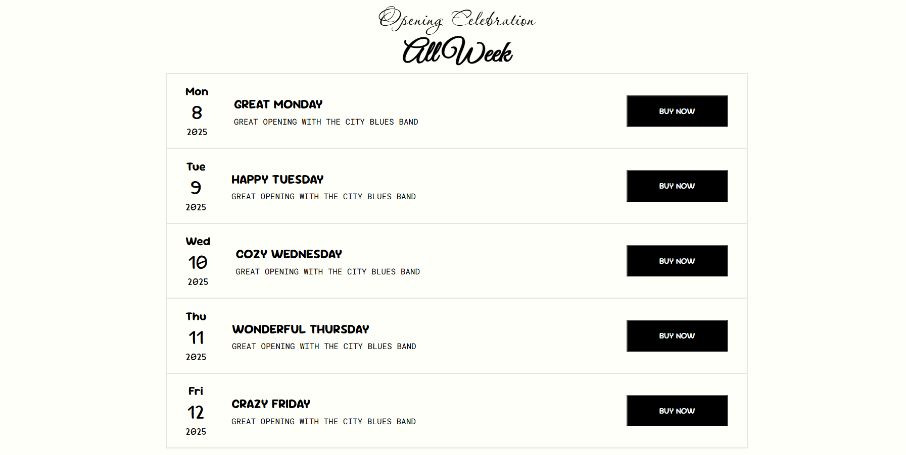

# 🍕 Responsive Restaurant Landing Page List Design| Day 11 - #100DaysOfCode

This is a custom-built, **fully responsive** restaurant landing page list design created as part of my learning on **Day 11** of the #100DaysOfCode challenge.

- Check it out and let me know what you think 👇  
  [`Click Here For Live Demo`](https://devxsameer.github.io/basic-projects/Project3)

---

## 📸 Preview

## 📄 Overview

Inspired by a restaurant-themed design image, I built a clean and modern landing page using just:

- **HTML5**
- **CSS Flexbox**
- **Google Fonts**

The entire layout adapts beautifully across screen sizes — **without using a single media query**! 😎

---

## 🎯 Goals

- Practice building a real-world layout
- Use **only Flexbox** for layout responsiveness
- Challenge myself to **not use media queries**
- Apply clean, semantic HTML and aesthetic styling

---

## 🧩 Features

- Fully responsive layout using Flexbox alone
- Google Fonts for clean, professional typography
- Clean and readable UI with logical section flow

---
