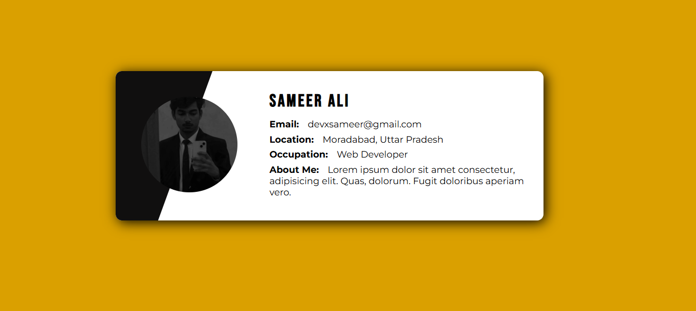

# basic-projects

A collection of beginner-friendly full-stack projects to practice core web development skills.

---

## Project 1

Built a fun little project: **"If HTML Tags Were People"** 😄  
Only used `HTML` — no `CSS`, no `JS`, just pure tag-powered creativity!  
Check it out and let me know what you think 👇  
🔗 [`Project Link`](/Project1)  
🔗 [`Live Demo`](https://devxsameer.github.io/basic-projects/Project1)  
#WebDev #HTML #CodeNewbie

---

## Project 2

I created a simple yet visually appealing **Profile Card** using only **HTML** and **CSS**, based on a reference image.  
Check it out and let me know what you think 👇  
🔗 [`Project Link`](/Project2/)  
🔗 [`Live Demo`](https://devxsameer.github.io/basic-projects/Project2)

#### 📸 Preview

#WebDev #HTML #CSS

---
