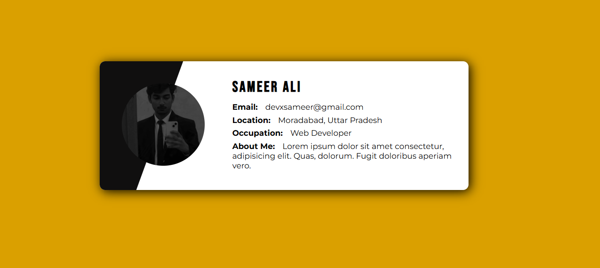
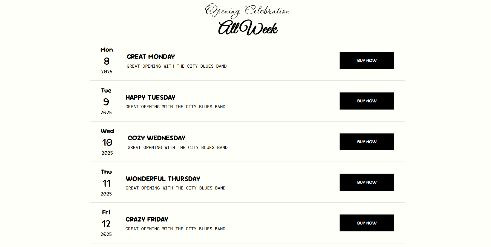
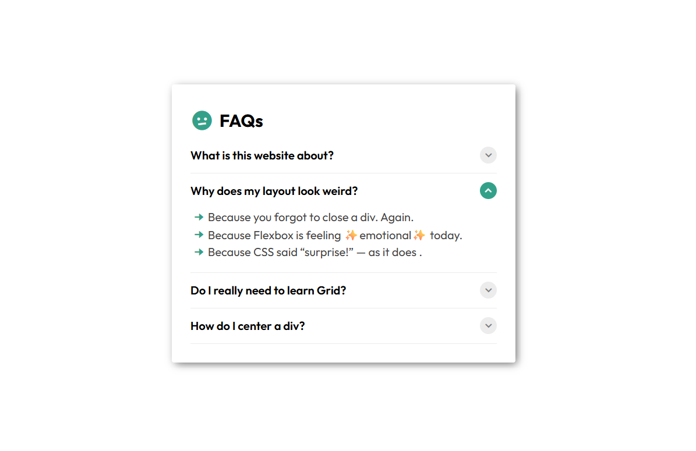

# basic-projects

A collection of beginner-friendly full-stack projects to practice core web development skills.

---

## Project 1 - `if-html-tags-were-people`

Built a fun little project: **"If HTML Tags Were People"** 😄  
Only used `HTML` — no `CSS`, no `JS`, just pure tag-powered creativity!  
Check it out and let me know what you think 👇  
🔗 See `if-html-tags-were-people` in [`my basic-projects repo`](https://github.com/devxsameer/basic-projects)  
🔗 [`Live Demo`](https://devxsameer.github.io/basic-projects/if-html-tags-were-people)  
#WebDev #HTML #CodeNewbie

---

## Project 2 - `css-profile-card`

I created a simple yet visually appealing **Profile Card** using only **HTML** and **CSS**, based on a reference image.  
Check it out and let me know what you think 👇  
🔗 See `css-profile-card` in [`my basic-projects repo`](https://github.com/devxsameer/basic-projects)  
🔗 [`Live Demo`](https://devxsameer.github.io/basic-projects/css-profile-card)

#### 📸 Preview

#WebDev #HTML #CSS

---

## Project 3 - `landing-page-list-design`

Created a custom-built, **fully responsive** restaurant landing page list design created as part of my learning on **Day 11** of the #100DaysOfCode challenge.  
Check it out and let me know what you think 👇  
🔗 See `landing-page-list-design` in [`my basic-projects repo`](https://github.com/devxsameer/basic-projects)  
🔗 [`Live Demo`](https://devxsameer.github.io/basic-projects/landing-page-list-design)

- The entire layout adapts beautifully across screen sizes — **without using a single media query**! 😎

#### 📸 Preview

#Flexbox #HTML #CSS

---

## Project 4 - `faq-design`

A simple and responsive **FAQ section** built with **HTML** and **CSS** — part of my `basic-projects` repo and #100DaysOfCode challenge.

Check it out and let me know what you think 👇  
🔗 See `faq-design` in [`my basic-projects repo`](https://github.com/devxsameer/basic-projects)  
🔗 [`Live Demo`](https://devxsameer.github.io/basic-projects/faq-design)

#### 📸 Preview

#100DaysOfCode #CSS #HTML #Frontend #FAQ #WebDev

---
